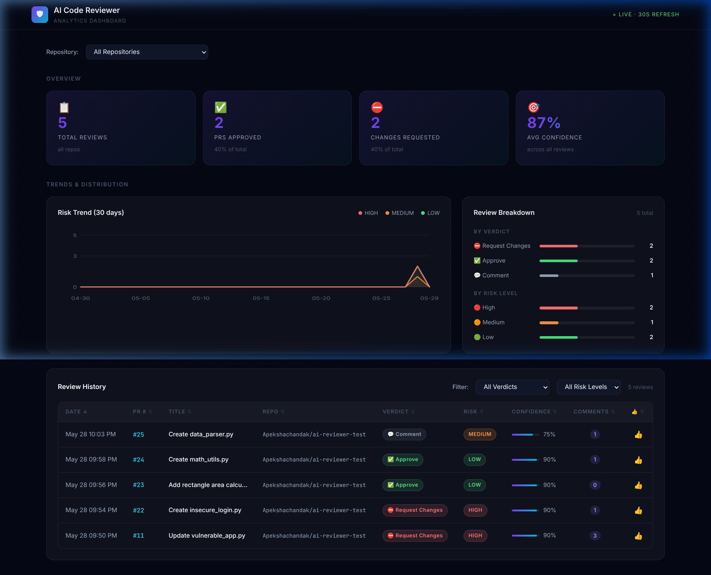

# AI Code Reviewer

An autonomous code review agent that connects to GitHub, analyzes pull requests for security vulnerabilities, and posts structured feedback as inline PR comments — no human in the loop.



## How it works
When a PR is opened, GitHub sends a webhook to the backend. The agent runs a two-step reasoning loop:

1. **Reason** — Gemini selects which analysis tools to run (vulnerability scanner, complexity analyzer, call graph, semantic search)
2. **Synthesize** — Gemini reads the tool outputs and produces a structured review: verdict, risk level, inline comments with line-specific suggestions, and a confidence score

The review is posted back to GitHub as a native PR review with inline comments. Every result is stored in a database and surfaced in a React analytics dashboard.

```
GitHub PR → Webhook → ReAct Agent → GitHub Review + DB + Dashboard
                           ↑
               FAISS · CodeBERT · AST · Gemini
```

## Features

- **Semantic vulnerability detection** — CodeBERT embeddings + FAISS nearest-neighbor search across known vulnerability patterns (SQL injection, command injection, path traversal, hardcoded secrets, insecure deserialization)
- **AST-based complexity analysis** — cyclomatic complexity and call graph blast-radius estimation per changed function
- **Inline PR comments** — line-specific suggestions posted directly to GitHub, snapped to valid diff positions
- **Analytics dashboard** — real-time risk trends, review history, per-repo breakdowns, and developer feedback (👍👎)
- **Evaluation framework** — benchmark the agent against labeled code samples; results served via API
- **One-command deployment** — Docker + docker-compose

## Quick start

**Local**
```bash
git clone <repo-url> && cd ai_code_reviewer
python -m venv venv && source venv/bin/activate
pip install -r requirements.txt
cp .env.example .env          # fill in GITHUB_TOKEN, WEBHOOK_SECRET, GEMINI_API_KEY
python main.py                # API → http://localhost:8000
cd dashboard && npm install && npm run dev  # Dashboard → http://localhost:3000
```

**Docker**
```bash
cp .env.example .env          # fill in credentials
docker compose up
# API → http://localhost:8000   Dashboard → http://localhost:3000
```

## Configuration

| Variable | Required | Description |
|---|---|---|
| `GITHUB_TOKEN` | ✓ | Personal Access Token with `repo` scope |
| `GITHUB_WEBHOOK_SECRET` | ✓ | Secret set in GitHub webhook settings |
| `GEMINI_API_KEY` | ✓ | Google AI Studio API key |
| `DATABASE_URL` | — | Defaults to SQLite (`sqlite:///./reviews.db`). Set to `postgresql://...` for Postgres |
| `PORT` | — | Defaults to `8000` |

## API

| Method | Endpoint | Description |
|---|---|---|
| `POST` | `/webhook/github` | GitHub webhook receiver |
| `POST` | `/agent/review/manual` | Trigger a review for any PR URL |
| `GET` | `/api/reviews` | Paginated review history (filterable by repo, verdict, risk) |
| `GET` | `/api/reviews/stats` | Aggregate stats for the dashboard |
| `GET` | `/api/reviews/trend` | Daily risk counts for the trend chart |
| `GET` | `/api/reviews/{id}` | Full review detail including inline comments |
| `POST` | `/api/reviews/{id}/feedback` | Submit 👍 / 👎 feedback (`{"score": 1\|-1\|0}`) |
| `GET` | `/api/eval/results` | Latest evaluation benchmark results |
| `GET` | `/docs` | Interactive Swagger UI |

## Running the evaluation

```bash
source venv/bin/activate
python scripts/evaluate.py            # full run (~4 min, uses Gemini)
python scripts/evaluate.py --dry-run  # validate dataset only
```

## Tech stack

| | |
|---|---|
| API | FastAPI + Uvicorn |
| Agent | Gemini 1.5 Flash (2-call ReAct loop) |
| Vulnerability scanner | FAISS + CodeBERT (`microsoft/codebert-base`) |
| Classifier | Fine-tuned DistilBERT |
| AST analysis | Python `ast` + tree-sitter |
| Database | SQLite / PostgreSQL |
| Dashboard | React 18 + Vite |
| Deployment | Docker + docker-compose |

## Tests

```bash
pytest tests/ -v
```
